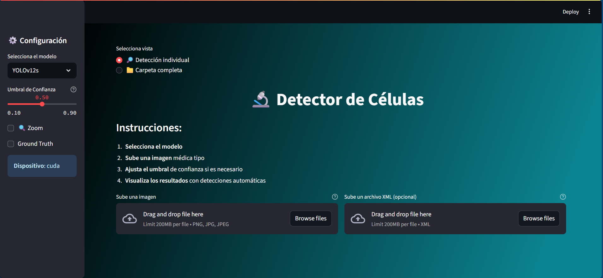

# **Sistema automatizado para la detección de células redondas en imágenes médicas mediante aprendizaje profundo**

## Memoria del Trabajo
Puedes consultar la [memoria completa del TFM aquí](./05.MemoriaFinalTrabajo/Plantilla_TFM_MURIA/build/Principal.pdf).